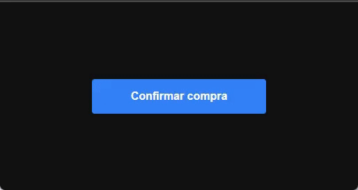

<h1 align="center">Mercado Livre Button Load Animation</h1>
<br/>
<br/>

<p align="center">

</p>
<br/>
<br/>

### Propriedades 🚀

<br/>

```javascript
    title: {
      type: String,
      default: "Button",
    },
    loading: {
      type: Boolean,
      default: false,
    },
    loadingTime: {
      type: Number,
      default: 1,
    },
    bgProgress: {
      type: String,
      default: "#5c95ff",
    },
    hoverBackground: {
      type: String,
      default: "#3483facc",
    },
    textColor: {
      type: String,
      default: "#FFF",
    },
    textHoverColor: {
      type: String,
      default: "#FFF",
    },
    background: {
      type: String,
      default: "#3483fa",
    },
    fontSize: {
      type: String,
      default: "16px",
    },
    borderRadius: {
      type: String,
      default: "4px",
    },
```


```
npm install
```

### Compiles and hot-reloads for development
```
npm run serve
```

### Compiles and minifies for production
```
npm run build
```

### Run your unit tests
```
npm run test:unit
```

### Run your end-to-end tests
```
npm run test:e2e
```

### Lints and fixes files
```
npm run lint
```

### Customize configuration
See [Configuration Reference](https://cli.vuejs.org/config/).
